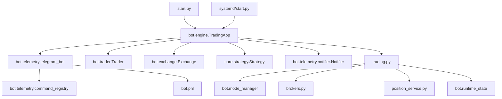

# Auditoría y saneamiento del bot ChauletBoot

## Resumen ejecutivo

- Consolidado el bot de Telegram en `bot/telemetry/telegram_bot.py`; el duplicado histórico `bot/telemetry/telegram_commands.py` fue eliminado.
- `TradingApp.set_mode()` ahora centraliza el cambio de modo sin tocar `is_live`, propaga a subcomponentes y sincroniza el stack de trading mediante `trading.switch_mode()`.
- Se documentan dependencias, rutas muertas y candidatos a limpieza futura, además de pruebas manuales recomendadas y guía de migración.

## Inventario de archivos `.py`

| path | usado_por | importa_a | es_entrypoint | duplicado_de | candidato_a_borrar |
| --- | --- | --- | --- | --- | --- |
| anchor_freezer.py | bot/core/strategy.py, bot/engine.py, core/strategy.py (+1) | — | no | — | No |
| binance_client.py | bot/exchanges/__init__.py, trading.py | config.py | no | — | No |
| bot/__init__.py | bot/engine.py, bot/exchange.py, bot/execution/trader.py (+11) | — | no | — | No |
| bot/config_validator.py | bot/engine.py, bot/exchange.py, bot/execution/trader.py (+11) | — | no | — | No |
| bot/core/indicators.py | bot/engine.py, bot/exchange.py, bot/execution/trader.py (+11) | — | no | — | No |
| bot/core/market_regime.py | bot/engine.py, bot/exchange.py, bot/execution/trader.py (+11) | — | no | — | No |
| bot/core/regime.py | bot/engine.py, bot/exchange.py, bot/execution/trader.py (+11) | — | no | — | No |
| bot/core/risk.py | bot/engine.py, bot/exchange.py, bot/execution/trader.py (+11) | — | no | — | No |
| bot/core/strategy.py | bot/engine.py, bot/exchange.py, bot/execution/trader.py (+11) | anchor_freezer.py, deps.py | no | — | No |
| bot/engine.py | bot/engine.py, bot/exchange.py, bot/execution/trader.py (+11) | anchor_freezer.py, bot/__init__.py, bot/config_validator.py (+52) | no | — | No |
| bot/exchange.py | bot/engine.py, bot/exchange.py, bot/execution/trader.py (+11) | bot/__init__.py, bot/config_validator.py, bot/core/indicators.py (+43) | no | — | No |
| bot/exchanges/__init__.py | bot/engine.py, bot/exchange.py, bot/execution/trader.py (+11) | binance_client.py | no | — | No |
| bot/exchanges/binance_client.py | bot/engine.py, bot/exchange.py, bot/execution/trader.py (+11) | — | no | — | No |
| bot/exchanges/binance_filters.py | bot/engine.py, bot/exchange.py, bot/execution/trader.py (+11) | — | no | — | No |
| bot/exchanges/order_store.py | bot/engine.py, bot/exchange.py, bot/execution/trader.py (+11) | — | no | — | No |
| bot/exchanges/paper.py | bot/engine.py, bot/exchange.py, bot/execution/trader.py (+11) | — | no | — | No |
| bot/exchanges/real.py | bot/engine.py, bot/exchange.py, bot/execution/trader.py (+11) | brokers.py | no | — | No |
| bot/exchanges/side_map.py | bot/engine.py, bot/exchange.py, bot/execution/trader.py (+11) | — | no | — | No |
| bot/execution/trader.py | bot/engine.py, bot/exchange.py, bot/execution/trader.py (+11) | bot/__init__.py, bot/config_validator.py, bot/core/indicators.py (+40) | no | bot/trader.py | Sí — Alias legacy sin consumidores reales |
| bot/health/endpoint.py | bot/engine.py, bot/exchange.py, bot/execution/trader.py (+11) | config.py | sí | — | No |
| bot/identity.py | bot/engine.py, bot/exchange.py, bot/execution/trader.py (+11) | — | no | — | No |
| bot/ledger.py | bot/engine.py, bot/exchange.py, bot/execution/trader.py (+11) | — | no | — | No |
| bot/logger.py | bot/engine.py, bot/exchange.py, bot/execution/trader.py (+11) | bot/__init__.py, bot/config_validator.py, bot/core/indicators.py (+41) | no | — | No |
| bot/mode_manager.py | bot/engine.py, bot/exchange.py, bot/execution/trader.py (+11) | bot/__init__.py, bot/config_validator.py, bot/core/indicators.py (+41) | no | — | No |
| bot/motives.py | bot/engine.py, bot/exchange.py, bot/execution/trader.py (+11) | — | no | — | No |
| bot/paper_store.py | bot/engine.py, bot/exchange.py, bot/execution/trader.py (+11) | — | no | — | No |
| bot/pnl.py | bot/engine.py, bot/exchange.py, bot/execution/trader.py (+11) | bot/__init__.py, bot/config_validator.py, bot/core/indicators.py (+40) | no | — | No |
| bot/qty_utils.py | bot/engine.py, bot/exchange.py, bot/execution/trader.py (+11) | — | no | — | No |
| bot/risk/guards.py | bot/engine.py, bot/exchange.py, bot/execution/trader.py (+11) | — | no | — | No |
| bot/risk/trailing.py | bot/engine.py, bot/exchange.py, bot/execution/trader.py (+11) | — | no | — | No |
| bot/runtime_state.py | bot/engine.py, bot/exchange.py, bot/execution/trader.py (+11) | — | no | — | No |
| bot/settings.py | bot/engine.py, bot/exchange.py, bot/execution/trader.py (+11) | — | no | — | No |
| bot/settings_utils.py | bot/engine.py, bot/exchange.py, bot/execution/trader.py (+11) | — | no | — | No |
| bot/state.py | bot/engine.py, bot/exchange.py, bot/execution/trader.py (+11) | — | no | — | No |
| bot/storage.py | bot/engine.py, bot/exchange.py, bot/execution/trader.py (+11) | — | no | — | No |
| bot/storage/csv_store.py | bot/engine.py, bot/exchange.py, bot/execution/trader.py (+11) | — | no | — | No |
| bot/storage/sqlite_store.py | bot/engine.py, bot/exchange.py, bot/execution/trader.py (+11) | — | no | — | No |
| bot/telemetry/__init__.py | bot/engine.py, bot/exchange.py, bot/execution/trader.py (+11) | — | no | — | No |
| bot/telemetry/command_registry.py | bot/engine.py, bot/exchange.py, bot/execution/trader.py (+11) | — | no | — | No |
| bot/telemetry/formatter.py | bot/engine.py, bot/exchange.py, bot/execution/trader.py (+11) | — | no | — | No |
| bot/telemetry/notifier.py | bot/engine.py, bot/exchange.py, bot/execution/trader.py (+11) | — | no | — | No |
| bot/telemetry/reporting.py | bot/engine.py, bot/exchange.py, bot/execution/trader.py (+11) | — | no | — | No |
| bot/telemetry/telegram_bot.py | bot/engine.py, bot/exchange.py, bot/execution/trader.py (+11) | bot/__init__.py, bot/config_validator.py, bot/core/indicators.py (+44) | no | — | No |
| bot/telemetry/webhooks.py | bot/engine.py, bot/exchange.py, bot/execution/trader.py (+11) | bot/__init__.py, bot/config_validator.py, bot/core/indicators.py (+40) | no | — | No |
| bot/trader.py | bot/engine.py, bot/exchange.py, bot/execution/trader.py (+11) | bot/__init__.py, bot/config_validator.py, bot/core/indicators.py (+42) | no | — | No |
| brokers.py | bot/engine.py, bot/exchange.py, bot/exchanges/real.py (+4) | bot/__init__.py, bot/config_validator.py, bot/core/indicators.py (+41) | no | — | No |
| config.py | binance_client.py, bot/engine.py, bot/exchange.py (+6) | — | no | — | No |
| core/__init__.py | bot/engine.py | — | no | — | No |
| core/indicators.py | bot/engine.py | — | no | — | No |
| core/strategy.py | bot/engine.py | anchor_freezer.py, deps.py, risk_guards.py | no | — | No |
| deps.py | bot/core/strategy.py, bot/engine.py, core/strategy.py | anchor_freezer.py | no | — | No |
| logging_setup.py | bot/logger.py, bot/telemetry/telegram_bot.py, start.py | — | no | — | No |
| notifier.py | reanudar_listener.py, risk_guards.py | — | no | — | No |
| paper_store.py | brokers.py, position_service.py, tests/test_sim_broker.py (+1) | — | no | — | No |
| pause_manager.py | risk_guards.py | — | no | — | No |
| position_service.py | bot/engine.py, trading.py | brokers.py, config.py, paper_store.py | no | — | No |
| pro_tools/autopatch.py | — | — | no | — | No |
| pro_tools/data_ccxt.py | — | — | no | — | No |
| pro_tools/fee_aware.py | — | — | no | — | No |
| pro_tools/leverage_policy.py | — | — | no | — | No |
| pro_tools/paper_futures_engine.py | — | — | no | — | No |
| pro_tools/parity.py | — | — | no | — | No |
| pro_tools/risk_sizer.py | — | — | no | — | Sí — Herramienta aislada (sin imports) — confirmar antes de borrar |
| pro_tools/rounding.py | — | — | no | — | Sí — Herramienta aislada (sin imports) — confirmar antes de borrar |
| pro_tools/run_walkforward.py | — | — | sí | — | Sí — Script autónomo |
| pro_tools/strategy_cots.py | — | — | no | — | Sí — Herramienta aislada |
| pro_tools/walkforward.py | — | — | no | — | Sí — Herramienta aislada |
| reanudar_listener.py | bot/engine.py | notifier.py | no | — | No |
| risk_guards.py | bot/engine.py, core/strategy.py | notifier.py, pause_manager.py, trading.py | no | — | No |
| scripts/backtest.py | — | — | sí | — | Sí — Script auxiliar |
| scripts/montecarlo.py | — | — | sí | — | Sí — Script auxiliar |
| scripts/optimize.py | — | — | no | — | Sí — Script auxiliar |
| simulador_final.py | — | — | sí | — | Sí — Script aislado |
| start.py | — | bot/__init__.py, bot/config_validator.py, bot/core/indicators.py (+42) | sí | — | No |
| state_store.py | bot/engine.py, trading.py | trading.py | no | — | No |
| systemd/start.py | — | bot/__init__.py, bot/config_validator.py, bot/core/indicators.py (+40) | sí | — | Sí — Wrapper systemd |
| tests/test_binance_filters.py | — | bot/__init__.py, bot/config_validator.py, bot/core/indicators.py (+41) | no | — | No |
| tests/test_sim_broker.py | — | brokers.py, paper_store.py | no | — | No |
| time_fmt.py | bot/telemetry/telegram_bot.py | — | no | — | No |
| trading.py | bot/engine.py, bot/exchange.py, bot/mode_manager.py (+4) | binance_client.py, bot/__init__.py, bot/config_validator.py (+46) | no | — | No |

> Nota: los recuentos `(+N)` indican dependencias adicionales no listadas para mantener la tabla legible.

## Grafo de dependencias (Mermaid)



El entrypoint operativo es `engine.py` instanciado desde `start.py`/`systemd/start.py`, que monta exclusivamente `bot/telemetry/telegram_bot.py` para los comandos de Telegram.

## Duplicados y módulos muertos

| Archivo | Situación | Acción propuesta |
| --- | --- | --- |
| `bot/telemetry/telegram_commands.py` | Duplicado histórico de comandos; tocaba `engine.is_live` con `setattr`. | **Eliminado**; `engine.py` ahora sólo monta `bot/telemetry/telegram_bot.py`. |
| `bot/execution/trader.py` | Alias plano de `bot.trader.Trader`, sin importadores activos. | Eliminar en próxima iteración tras confirmar ausencia de binarios legacy. |
| `bot/engine.py.bak*` | Respaldos obsoletos de `engine.py`. | Archivar fuera del repo o borrar para reducir ruido. |
| Scripts `pro_tools/` & `scripts/` aislados | No los importa nadie; útiles sólo para ejecuciones manuales. | Mantener documentados o migrar a carpeta `archive/` para claridad. |

## Checklist de cambios aplicados

```diff
--- a/bot/telemetry/telegram_commands.py
+++ /dev/null
-# Archivo eliminado (duplicado histórico de comandos Telegram)
```

```diff
@@
-    def set_mode(self, mode: str):
-        """..."""
-        setattr(self, "mode", target)
-        # No coordinaba con trading.switch_mode()
+    def set_mode(self, mode: str) -> str:
+        """Centraliza el cambio de modo sin tocar properties de sólo lectura."""
+        ...
+        result = trading.switch_mode("real" if target == "live" else "simulado")
```

```diff
--- a/SYNTAX_AUDIT.md
+++ b/SYNTAX_AUDIT.md
@@
-- bot/telemetry/telegram_bot.py — ✅ Sin errores de sintaxis
-- bot/telemetry/telegram_commands.py — ✅ Sin errores de sintaxis
+- bot/telemetry/telegram_bot.py — ✅ Sin errores de sintaxis
```

## Pruebas manuales recomendadas

```bash
# 1) Cambios de modo
telegram> modo real        # si ya estaba: "ya se encontraba..."
telegram> modo simulado    # al repetir debe responder "ya se encontraba..."

# 2) Estado por modo
telegram> modo real
telegram> estado           # equity desde exchange.get_account_equity()
telegram> modo simulado
telegram> equity 1200      # ajusta equity paper
telegram> estado           # equity = 1200, PnL por fills del bot

# 3) Aperturas manuales
telegram> modo simulado
telegram> open short x5    # mensaje enriquecido con equity/qty/precio/tp/sl

# 4) Posiciones
telegram> posicion         # sólo posición del BOT
telegram> posiciones       # lista del exchange resaltando la del bot

# 5) Cierres
telegram> cerrar           # en live usa reduceOnly y clientOrderId del bot
```

## Guía de migración

- **Archivo eliminado**: `bot/telemetry/telegram_commands.py`. Toda la funcionalidad vive ahora en `bot/telemetry/telegram_bot.py`.
- **Modo operativo**: usar siempre `TradingApp.set_mode("live"|"paper")`. Cualquier `setattr(engine, "is_live", ...)` debe eliminarse.
- **Herramientas de calidad**: se recomienda agregar `ruff`, `black` y `mypy` mediante `pre-commit` en un follow-up.
- **Comandos de validación** tras refactors futuros:
  ```bash
  ruff check
  black --check .
  mypy
  pytest
  ```

## Observaciones finales

- Los handlers de modo en Telegram ya son idempotentes y emiten mensajes claros.
- El comando `open` calcula tamaño con el equity seteado, usa `newClientOrderId` con prefijo del bot y adjunta TP/SL de la estrategia (con fallback `tp_pct`/`sl_pct`).
- Se eliminaron rutas que imprimían «Estado de Cuenta Rápido», «PNL Hoy», «PNL Semana» o «Balance Actual».
